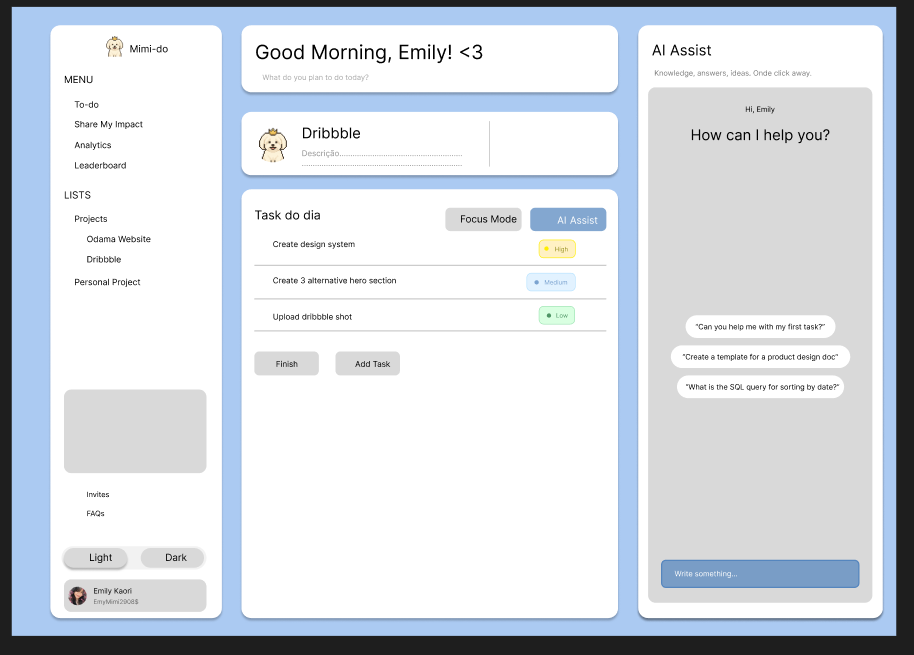

# Mimi-do
To-do list with authentication and AI Assistant.

Este é um projeto de To-Do List com funcionalidades completas de autenticação, organização de tarefas e personalização de interface. Criado com React e Firebase, oferecendo uma experiência moderna e intuitiva para gerenciar seu dia a dia.

### Funcionalidades

- CRUD completo de tarefas com armazenamento em tempo real via Firestore.
- Autenticação de usuários com Firebase Auth.
- Modo escuro/claro com persist^`encia no localStorage.
- Tarefas categorizadas com filtros por status e prioridade.
- Drag and drop para reordenar tarefas facilmente.
Busca e ordenação dinâmica.
- Chat com IA assistente, integrado à API da OpenAI, para sugestões, motivação e ajuda na organização.

### Tecnologias utilizadas

- React
- Firebase Auth & Firestore
- React Router DOM
- React Beutiful DnD
- OpenAI API
- Context API para tema e autenticação
- Deploy via Vercel
- Figma

### Interface Temporária realizada no Figma

Obs: O Readme foi realizado no início do projeto atualmente, com funcionalidades e tecnologias estimadas para o projeto, mas ao decorrer do desenvolvimento pode-se haver mudanças.